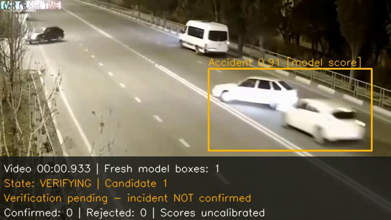
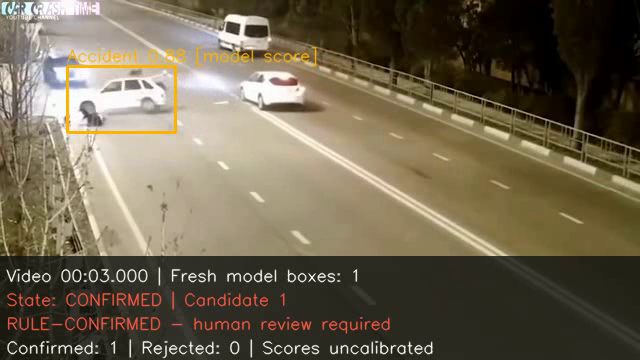
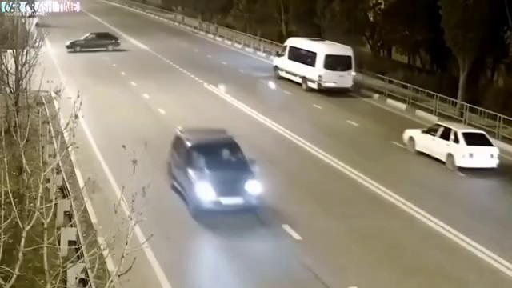
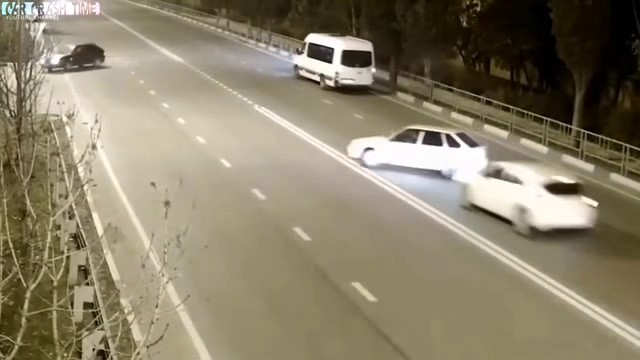
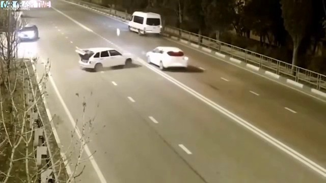

<div align="center">


# Traffic Accident Video Detection Using Deep Learning

### A Deep-Learning Decision-Support Prototype for Video-Based Accident Incidents

**Anand Institute of Higher Technology (AIHT) - An Autonomous Institute**
**Kazhipattur, Chennai**

---

*A local, rule-based temporal decision engine wrapped around an*
**accident-specific YOLO checkpoint** *to convert raw per-frame detections*
*into auditable, timestamped incident reports with supporting evidence.*

[](https://www.python.org/)
[](https://pytorch.org/)
[](https://github.com/ultralytics/ultralytics)
[](https://docs.opencv.org/4.x/)
[](LICENSE)
[](https://pytorch.org/)

</div>

---

## Table of Contents

1. [Project at a Glance](#1-project-at-a-glance)
2. [Checkpoint and Model Details](#2-checkpoint-and-model-details)
3. [Visual Snapshot](#3-visual-snapshot)
4. [Repository Layout](#4-repository-layout)
5. [Team, Institute and Supervisor](#5-team-institute-and-supervisor)
6. [Motivation and Problem Statement](#6-motivation-and-problem-statement)
7. [System Architecture](#7-system-architecture)
8. [Technical Background](#8-technical-background)
9. [The Temporal Decision Engine](#9-the-temporal-decision-engine)
10. [Processing Pipeline](#10-processing-pipeline)
11. [Installation](#11-installation)
12. [Running the Project](#12-running-the-project)
13. [Configuration and CLI Options](#13-configuration-and-cli-options)
14. [Outputs and Result Interpretation](#14-outputs-and-result-interpretation)
15. [Evaluation](#15-evaluation)
16. [Performance Matrix](#16-performance-matrix)
17. [Testing](#17-testing)
18. [Limitations and Future Work](#18-limitations-and-future-work)
19. [Acknowledgements](#19-acknowledgements)
20. [License](#20-license)

---

## 1. Project at a Glance

A single-frame object detector answers *"is there an accident-shaped object
right now?"*. That is not sufficient for a safety tool, because real footage is
full of **isolated false positives** - a parked car, a braking vehicle, a shadow,
a compression artefact - and equally full of **real accidents that are brief and
partly occluded**.

This project delivers a **local video-analysis framework** that:

- Runs an **accident-specific YOLO checkpoint** (Ultralytics `yolov11m`, single
  class `Accident`) over every frame of a local video.
- Feeds the raw per-frame detections into a **model-independent temporal
  decision engine** that requires persistence, continuity and a minimum support
  ratio before a candidate is confirmed - which suppresses isolated spikes.
- Publishes a **versioned incident report bundle** (`result.json` +
  human-readable `report.md`) containing deterministic incident IDs, source and
  checkpoint SHA-256 hashes, full decision history, and rejected/unresolved
  candidates - not just the final answer.
- Selects **up to three original-frame evidence images** per confirmed incident
  (before / strongest / after) so a human reviewer can verify the claim.
- Optionally writes an **annotated video** with fresh boxes, model scores,
  video time and live temporal state.
- Runs **fully offline on CPU**, with no cloud dependency and no network calls.

> **Honesty statement.** A `confirmed_incident` result means the temporal
> evidence requirements passed. It is **not** independently verified ground
> truth, and human review is always required. No labeled held-out dataset
> ships with this repository, so real-world accuracy on unseen footage is
> **not yet established**. See [Section 18](#18-limitations-and-future-work).

---

## 2. Checkpoint and Model Details

The project uses a **pre-trained accident-specific checkpoint** published on the
Ultralytics Platform. It is **downloaded separately by the user** and is not
committed to this repository, since `.pt` files are excluded by `.gitignore`.

| Property | Value |
|---|---|
| Checkpoint | [`jhastin/car-accident/yolov11m`](https://platform.ultralytics.com/jhastin/car-accident/yolov11m) |
| Expected path | `models/yolov11.pt` |
| Architecture | YOLO11 - medium (`yolo11m`) |
| File size | ~38.6 MiB (40,501,996 bytes) |
| SHA-256 | `9671f95363f05fff285e5290500ee0c935738b5be094037f29dc9780b420ec13` |
| Task | `detect` |
| Class map | `{0: 'Accident'}` (single class) |
| Accelerator used | GPU `device=3`, AMP enabled |
| Wall-clock training | ~1 h 17 min |

The application **verifies** the checkpoint's task and class labels at load
time rather than assuming a class ID. It never silently downloads fallback
weights, substitutes a generic COCO detector, or starts training.

### Reported Training Metrics

Values below are transcribed from the checkpoint export's
`models/performance-metrics.json`. They describe **upstream per-frame
detection validation** and have **not been independently reproduced here**.

| Metric | Reported Value |
|---|---:|
| Precision | 0.951111 |
| Recall | 0.971402 |
| mAP@0.50 | 0.987740 |
| mAP@0.50:0.95 | 0.857349 |
| Final epoch | 100 |
| Train box / cls / dfl loss | 0.35717 / 0.20340 / 0.89345 |
| Val box / cls / dfl loss | 0.56876 / 0.29137 / 0.97868 |

> **These per-frame detection metrics do not establish this application's
> video-level precision, recall, or false-alarm rate on different footage.**
> A detector that fires correctly on still images can still produce a high
> video-level false-alarm rate, which is precisely why the temporal layer and
> a labeled evaluation set exist here.

### Training Configuration

Transcribed from `models/training-configuration.json`:

| Parameter | Value | Parameter | Value |
|---|---|---|---|
| Base model | `yolo11m` | Epochs | 100 |
| Image size | 640 | Batch | `-1` (auto) |
| Optimizer | `auto` | AMP | enabled |
| `lr0` / `lrf` | 0.01 / 0.01 | Momentum | 0.937 |
| Weight decay | 0.0005 | Warmup epochs | 3.0 |
| `close_mosaic` | 10 | Seed | 0 (deterministic) |
| Loss weights (box/cls/dfl) | 7.5 / 0.5 / 1.5 | NMS IoU / max_det | 0.7 / 300 |
| Augmentation | mosaic 1.0, fliplr 0.5, scale 0.5, translate 0.1 | HSV h/s/v | 0.015 / 0.7 / 0.4 |
| Dataset | `ul://jhastin/datasets/car-accident-detectionv1iyolov11` | Classes | `Accident` (single) |

---

## 3. Visual Snapshot

Captured from a **real verified run** of this repository on
`test_clip/accident_demo.mp4` (640x360, 30 FPS). The pair below shows the
temporal engine mid-decision and then confirmed.

<div align="center">

| Frame 28 - `VERIFYING` (peak model score 0.91) | Frame 90 - `CONFIRMED` (t+3.000s) |
|:---:|:---:|
|  |  |

</div>

<div align="center">

| `before` - 0.000s | `strongest` - 0.933s | `after` - 1.933s |
|:---:|:---:|:---:|
|  |  |  |

</div>

The **overlay** on the annotated frames shows, top to bottom: video timestamp,
number of fresh model boxes, the live temporal `State`, the confirmation verdict,
and confirmed/rejected counters - so a reviewer watching the preview can see
*why* the engine reached its decision, not just the final call. The **evidence
images** are unannotated original decoded pixels, with the box coordinates and
scores preserved in `result.json` instead.

For the upstream per-frame validation plots (PR curve, F1-vs-confidence,
confusion matrix, full training curves), see the
[Ultralytics Platform model page](https://platform.ultralytics.com/jhastin/car-accident/yolov11m).

---

## 4. Repository Layout

```text
Accident_Detection/
|-- README.md                       <- You are here
|-- LICENSE                         <- Unlicense (public domain)
|-- requirements.txt                <- Pinned Python dependencies
|-- .gitignore                      <- Excludes weights / videos / artifacts
|-- config.json                     <- Validated runtime defaults
|
|-- main.py                         <- Video analysis CLI
|-- evaluate.py                     <- Labeled whole-video evaluation
|-- benchmark.py                    <- Local processing benchmark
|-- evaluation_manifest.example.json<- Template manifest for labeled data
|
|-- traffic_accident/               <- Modular application package
|   |-- config.py, cli.py, paths.py <- Validated settings, overrides, paths
|   |-- checkpoint.py, detector.py  <- Checkpoint validation, reusable detector
|   |-- video.py, timestamps.py     <- Video I/O and time provenance
|   |-- preview.py                  <- GUI preview
|   |-- decision.py                 <- Temporal candidate state machine
|   |-- annotation.py, evidence.py  <- Overlays, bounded evidence selection
|   |-- contracts.py, reporting.py  <- Stable identity, validated reports
|   |-- atomic.py, retention.py     <- Safe publication, optional retention
|   |-- integration.py              <- Local callback + simulation interface
|   |-- workflow.py                 <- Processing orchestration
|   `-- evaluate.py, benchmark.py   <- Metrics and throughput measurement
|
|-- tests/                          <- Offline unit / integration suite (108)
|-- docs/                           <- Architecture, rules, schemas, integration
|   |-- ARCHITECTURE.md, DECISIONS.md
|   |-- EVALUATION.md, INTEGRATION.md
|   `-- RESULTS.md, result.schema.json
|
|-- assets/                         <- Logo and verified-run snapshots
|-- models/                         <- Locally supplied checkpoints (.pt ignored)
|-- test_clip/                      <- Locally supplied footage (.mp4 ignored)
|-- outputs/                        <- Annotated videos / redirected JSON
|-- incidents/                      <- Published report bundles
`-- logs/                           <- Runtime caches / local simulation records
```

---

## 5. Team, Institute and Supervisor

| Field | Value |
|---|---|
| **College** | Anand Institute of Higher Technology (AIHT) - An Autonomous Institute |
| **Location** | Kazhipattur, Chennai |
| **Degree** | B.E. Computer Science & Engineering |
| **Department** | Computer Science & Engineering |
| **Academic Year** | 2023 - 2027 |
| **Supervisor** | Mrs. J. Vinothini, Department of CSE, AIHT |

### Team Members

| # | Name | Roll Number | GitHub |
|---|---|---|---|
| 1 | Rohith Kumar P | 310123104304 | [Rohith Kumar P](https://github.com/Rohith-vencenzo) |
| 2 | Sivaprakash J | 310123104093 | [Sivaprakash J](https://github.com/CoreCoderX) |
| 3 | Kamalnath U | 310123104302 | [Kamalnath U](https://github.com/kamal003-gid) |

---

## 6. Motivation and Problem Statement

Watching CCTV footage for accidents is **non-scalable and fatigue-limited**. A
control-room operator cannot sustain attention across many simultaneous streams
for a full shift, and reviewing hours of tape after the fact means the *golden
hour* has already passed. Manual review also produces **no audit trail** - it is
rarely possible to reconstruct afterwards exactly why an alarm was or was not
raised.

Traffic camera feeds already exist in enormous numbers, so the practical gap is
not *recording* but *interpretation*. This project targets that gap with a
deliberately conservative stance:

1. **Convert per-frame detections into incident-level decisions.** A confirmed
   incident must be supported by multiple frames across a time span, not one
   lucky frame.
2. **Make every decision auditable.** Each candidate carries a full state
   history, a closure reason, and the diagnostic reasons it was rejected - so
   the thresholds can be tuned with evidence instead of guesswork.
3. **Emit verifiable evidence, not just a boolean.** Original before /
   strongest / after frames plus hashes let a human confirm or reject each alert.
4. **Stay fully local and offline.** Surveillance footage is sensitive; this
   prototype never phones home, never uploads frames, and never dispatches
   anything.

The research hypothesis is that **a well-specified temporal rule layer can
meaningfully reduce the false-alarm rate of a high-recall single-frame accident
detector without retraining it** - and that the resulting system can be
*explained* well enough for a human reviewer to trust its output.

---

## 7. System Architecture

```text
                +------------------------- Input layer ----------------------+
                |  Local video file (constant-resolution, decodable container) |
                +------------------------------+-----------------------------+
                                               |
                          OpenCV reader + explicit timestamp provenance
                          (decoder PTS, with a marked FPS fallback if invalid)
                                               |
                                               v
                +----------------------------------------------------------+
                |            Reusable YOLO detector (loaded once)             |
                |  accident-specific checkpoint, task + classes verified       |
                |  -> per-frame boxes, class names, scores                   |
                +------------------------------+-----------------------------+
                                               |
                                     Frame observations
                                               |
                                               v
                +----------------------------------------------------------+
                |          Temporal decision engine (decision.py)              |
                |  rolling video-time window / persistence / continuity /     |
                |  positive-ratio  ->  candidate state machine                |
                |  states: PENDING -> VERIFYING -> CONFIRMED / REJECTED /      |
                |          UNRESOLVED                                        |
                +------------------------------+-----------------------------+
                                               |
              +--------------------------------+-------------------------------+
              |                                |                               |
              v                                v                               v
   +--------------------+          +--------------------+          +--------------------+
   |  Live preview      |          |  Annotated video   |          |  Evidence frames   |
   |  (--show)          |          |  (--save-output)  |          |  before/strongest/  |
   |  boxes + score +   |          |  constant-FPS MP4  |          |  after (original   |
   |  state + counters  |          |                    |          |  decoded pixels)   |
   +--------------------+          +--------------------+          +--------------------+
              |                                |                               |
              +--------------------------------+-------------------------------+
                                               |
                                               v
                +----------------------------------------------------------+
                |   Validated, atomically published report bundle            |
                |   result.json  (versioned contract, hashes, timings)        |
                |   report.md    (human-readable summary)                     |
                |   COMPLETE.json (publication manifest)                     |
                +------------------------------+-----------------------------+
                                               |
                                               v
                +----------------------------------------------------------+
                |   Optional local callback / simulation-only alert log        |
                |   (no network request, no dispatch, no emergency action)    |
                +----------------------------------------------------------+
```

The detector and the temporal engine are **decoupled**: swapping in another
approved checkpoint requires no change to the decision logic.

---

## 8. Technical Background

### 8.1 YOLO - You Only Look Once

YOLO frames object detection as a **single regression problem**: a
fully-convolutional backbone predicts, in one forward pass, both class
probabilities and bounding-box coordinates for every cell of a spatial grid.
This monolithic design is far faster than two-stage detectors such as
Faster R-CNN while retaining competitive accuracy - which is why it dominates
real-time and near-real-time video workloads.

The [`yolo11m`](https://docs.ultralytics.com/models/yolo11/) **medium** variant
is used here. It sits between the `n` (nano, fastest) and `l`/`x` (larger, most
accurate) variants, trading a little speed for meaningfully better recall -
which matters because for accident detection a **missed** event is worse than
an extra candidate that the temporal layer will later reject.

**Detection score is not probability.** The 0.91 shown in the snapshot above is
an uncalibrated model confidence, and it is deliberately reported as a *model
score* in the overlay so it cannot be mistaken for a calibrated accident
probability.

### 8.2 Why a Single Frame Is Not a Decision

A naive per-frame classifier produces two failure modes that matter in practice:

- **False positives that persist.** A parked damaged car, a slow braking
  vehicle, or a fixed camera angle with a permanent occlusion can score above
  threshold on *every single frame*. No amount of smoothing removes this,
  because the evidence is genuinely continuous.
- **False negatives that are brief.** A real collision visible for only a few
  frames, partially occluded by a passing truck, can be missed entirely by a
  stride of 1 if the scoring threshold is set high to control false positives.

The engine addresses the second failure mode by keeping the scoring threshold
moderate and demanding **temporal corroboration** instead of a single high
score. This deliberately trades a small amount of extra sensitivity for a much
lower video-level false-alarm rate.

### 8.3 Timestamps Are First-Class Data

Video FPS metadata is frequently missing or wrong, and OpenCV's
`CAP_PROP_POS_MSEC` is unreliable for some containers. This project therefore
records, for every frame observation, **where its timestamp came from** -
decoder-reported PTS or an explicitly-marked FPS fallback - and reports
timestamp estimates separately from decoder-derived times. Timestamps are
derived from **video time**, never from wall-clock processing time, so the
decision logic stays correct no matter how fast inference runs.

---

## 9. The Temporal Decision Engine

The engine is **model-independent**: it consumes `(timestamp, detections)`
observations and knows nothing about YOLO. All thresholds live in
`config.json` under `decision` and can be overridden per run.

```text
observation in
      |
      v
  score >= support_confidence ?  --no-->  frame votes NEGATIVE (weak)
      | yes
      v
  append timestamp to the rolling evidence window
      |
      v
  evict samples older than window_seconds, and RESET on a
  sample gap larger than max_sample_gap_seconds
      |
      v
  evaluate ALL of the following simultaneously:
      - supporting_frames      >= min_support_frames
      - (last - first) span    >= min_support_span_seconds
      - positive / observed    >= min_positive_ratio
      - consecutive supporting >= min_consecutive_frames
      |
      +-- all pass --> CONFIRMED (record confirmed_at, freeze support window)
      |
      +-- any fail --> stays VERIFYING, keeps accumulating
      |
      v
  close candidate when time since last qualifying support
  exceeds event_gap_seconds  -->  REJECTED or UNRESOLVED
```

Three rules deserve emphasis, because they are the ones most naive
implementations get wrong:

1. **All requirements must pass together.** Passing four of five thresholds is
   still `VERIFYING`, never `CONFIRMED`.
2. **Skipped frames abstain.** With `--frame-stride N`, non-inferred frames cast
   neither a positive nor a negative vote - they are *absent*, not negative.
   Otherwise a large stride would silently guarantee rejection.
3. **Multiple boxes on one frame still count once.** Frame-level voting
   prevents a single cluttered frame from manufacturing support.

The default thresholds were **chosen to be conservative, not calibrated**. They
should be tuned on separate calibration videos and never on the final test set.

---

## 10. Processing Pipeline

```text
1. Validate config + CLI overrides          -> schema_version checks, type/range
2. Verify checkpoint task and class labels   -> fail loudly, never silently substitute
3. Probe source (width/height/FPS/frames)    -> mark assumed FPS explicitly
4. Open reader, infer timestamps             -> decoder PTS or marked fallback
5. FOR each decoded frame:
     a. optionally run detector              -> boxes, scores, class ids
     b. build frame observation              -> timestamp + detections
     c. feed temporal engine                 -> update candidate states
     d. draw overlay (preview / writer)      -> boxes, score, time, state
6. Close and group candidates                -> CONFIRMED / REJECTED / UNRESOLVED
7. Select evidence frames per confirmed      -> before / strongest / after
8. Stage, validate, then publish bundle      -> atomic; COMPLETE.json manifest
9. Optionally apply retention                -> verified bundles only
```

Every stage is bounded and exception-safe: a truncated or unreadable video ends
the run as **`inconclusive`** (partial coverage) rather than being misreported as
"no accident found". This distinction is enforced throughout the JSON contract.

---

## 11. Installation

### 11.1 Prerequisites

| Requirement | Notes |
|---|---|
| **OS** | Windows 10/11 (verified) or Ubuntu 22.04+ / WSL2 (verified) |
| **Python** | 3.13.3 verified on Windows; 3.14.4 verified on WSL. Intended range **3.12 - 3.14** |
| **Accelerator** | Optional. CPU-only is fully supported; CUDA needs a matching PyTorch build |
| **Disk** | ~1 GB for the environment plus room for videos and reports |
| **Display** | Required only for `--show`; headless analysis works without one |

### 11.2 Create the Virtual Environment

Windows and Linux/WSL environments **cannot be shared** - a `.venv` built on one
platform cannot be reused on the other.

**Windows PowerShell**

```powershell
python -m venv .venv
.\.venv\Scripts\Activate.ps1
```

**Linux / WSL / bash**

```bash
python3 -m venv .venv
source .venv/bin/activate
```

If PowerShell activation is blocked by the execution policy, allow it for the
current session or call the interpreter directly:

```powershell
Set-ExecutionPolicy -Scope Process -ExecutionPolicy Bypass
.\.venv\Scripts\python.exe --version
```

### 11.3 Install Dependencies

For a **CPU** installation, run these inside the active environment:

```text
python -m pip install --index-url https://download.pytorch.org/whl/cpu "torch>=2.9,<2.12" "torchvision>=0.24,<0.27"
python -m pip install -r requirements.txt
python -m pip check
```

For CUDA, install compatible wheels using the
[official PyTorch guide](https://pytorch.org/get-started/locally/) first. A
visible GPU alone does not guarantee the installed PyTorch build supports it.

### 11.4 Supply the Checkpoint

Download `yolov11m` from the
[Ultralytics Platform model page](https://platform.ultralytics.com/jhastin/car-accident/yolov11m)
and place it at `models/yolov11.pt`. Weights are **not** committed to this
repository.

### 11.5 Verify the Installation

```bash
python main.py --check-env --check-model --print-config
python main.py --source "test_clip/accident_demo.mp4" --check-source
```

The first command reports the interpreter, dependency versions, OpenCV runtime
build, and whether CUDA is visible to PyTorch. The second probes source metadata
and decodes the first frame - it is not a full-file integrity check.

---

## 12. Running the Project

### 12.1 Analyze and Preview

```bash
python main.py --source "test_clip/accident_demo.mp4" --show
```

Press **Q** or **Escape**, or close the preview window, to stop early. Early
stops are reported as **partial coverage**, never as a clean negative. Preview
runs at *processing speed*, not guaranteed real-time playback.

### 12.2 Save Video, Evidence and Reports

```bash
python main.py --source "test_clip/accident_demo.mp4" --no-show --save-output --output-dir "outputs/review run" --json
```

Creates a uniquely named annotated MP4 plus a report bundle under
`outputs/review run/incidents/`. Reports and evidence are written **by default**
even when annotated-video saving is not requested.

### 12.3 Quick CPU Check

```bash
python main.py --source "test_clip/accident_demo.mp4" --no-show --no-save --device cpu --imgsz 320 --frame-stride 3 --max-frames 12 --json
```

Inspects only part of the clip. Smaller images and a larger stride cut compute
but can miss small or brief accident-like imagery.

### 12.4 Path Conventions

| Shell | Path form |
|---|---|
| Windows PowerShell / cmd | `"C:\Videos\traffic clip.mp4"` |
| WSL / bash | `"/mnt/c/Videos/traffic clip.mp4"` |

A Windows drive path is **not** a valid argument inside WSL, and vice versa.

### 12.5 Redirect JSON to a File

```bash
python main.py --source "test_clip/accident_demo.mp4" --no-show --json > "outputs/result.json"
```

JSON goes to **stdout**; progress and errors go to **stderr**. Create the
destination directory first, and do not merge the two streams when parsing.

---

## 13. Configuration and CLI Options

`config.json` holds validated defaults; explicit CLI flags override them.
Relative paths are resolved from the project root regardless of the shell's
working directory.

| Option | Default / Purpose |
|---|---|
| `--source <path>` | **Required** local video for processing |
| `--model <path>` | `models/yolov11.pt`; replace the configured checkpoint |
| `--config <path>` | Use another validated JSON configuration |
| `--show` / `--no-show` | Enable/disable the preview window; default disabled |
| `--save-output` | Save the annotated video; default disabled |
| `--output <path>` | Set the MP4/mp4v or AVI/MJPG path; also enables saving |
| `--output-dir <path>` | Base directory for videos and `incidents/` bundles |
| `--no-save` | Disable all saved analysis artifacts |
| `--no-evidence` | Keep reports but omit evidence images |
| `--json` | Print exactly one machine-readable result |
| `--confidence`, `--conf` | Detector score threshold; default `0.4` |
| `--imgsz` | Inference size, multiple of 32; default `640` |
| `--frame-stride`, `--stride` | Infer every Nth frame; default `1` |
| `--device` | `cpu`, `mps`, CUDA index (`0`), or `cuda:0`; **no silent fallback** |
| `--max-frames` | Cap decoded frames; a capped run is marked partial |
| `--cpu-threads` | PyTorch intra-op threads; default `4` |
| `--fallback-fps` | FPS assumption for invalid metadata; default `30` |
| `--evidence-context-seconds` | Before/after context around the strongest frame; default `1.0` |
| `--retain-runs` / `--retention-days` | Optional managed-bundle retention; disabled by default |
| `--simulate-alerts` | Write local simulation-only incident events; **no network, no dispatch** |
| `--check-env`, `--check-model`, `--check-source`, `--print-config` | Setup diagnostics only |

### Temporal Decision Thresholds

| Temporal Setting | Default | CLI Option |
|---|---:|---|
| Supporting model score | 0.6 | `--event-confidence` |
| Rolling evidence window | 1.5 s | `--event-window-seconds` |
| Minimum supporting frames | 3 | `--event-min-frames` |
| Minimum support span | 0.5 s | `--event-min-span-seconds` |
| Minimum positive-frame ratio | 0.6 | `--event-min-ratio` |
| Minimum consecutive supports | 3 | `--event-min-consecutive` |
| Maximum sample gap | 0.5 s | `--event-max-sample-gap-seconds` |
| Candidate grouping gap | 1.0 s | `--event-gap-seconds` |

**All** confirmation requirements must pass together, and every threshold is
uncalibrated by design. Tune them on separate calibration videos - never on the
final test set. Full definitions live in [docs/DECISIONS.md](docs/DECISIONS.md).

---

## 14. Outputs and Result Interpretation

By default, a successful analysis publishes a bundle **even when no incident is
confirmed**, so "we looked and found nothing" is as auditable as a positive.

```text
incidents/run_<unique-id>/
|-- result.json              # versioned contract, hashes, timings, warnings
|-- report.md                # human-readable summary
|-- COMPLETE.json            # publication manifest (written last)
`-- evidence/inc_<stable-id>/
    |-- before.jpg
    |-- strongest.jpg
    `-- after.jpg
```

The `before` / `after` roles are included only when the clip actually provides
the requested context. Evidence images contain **original decoded pixels**
without overlay boxes; coordinates and scores are preserved in `result.json`.
Before/after refer to the *strongest evidence frame*, **not** to proven impact
boundaries.

| Result | Interpretation |
|---|---|
| `true` / `confirmed_incident` | At least one candidate passed every temporal rule. **Human verification still required.** |
| `false` / `no_confirmed_incident` | Complete processing found no qualifying candidate. This does **not** prove the clip is accident-free. |
| `null` / `inconclusive` | Partial processing produced no confirmation. Whole-video negative classification is unavailable. |

Bundles are **staged, validated, then published atomically** with a completion
manifest, so a reader never observes a half-written bundle. Retention targets
only verified, unmodified, generated bundles and never touches unmanaged or
user-modified files; annotated videos are not auto-purged. Camera and location
labels are **explicitly registered metadata, never inferred GPS**.

See [docs/RESULTS.md](docs/RESULTS.md) and
[docs/result.schema.json](docs/result.schema.json).

---

## 15. Evaluation

Copy `evaluation_manifest.example.json` and replace the placeholders with
labeled **whole videos**. Each entry identifies an `accident` or `normal` clip,
its `calibration` or `test` split, optional camera/location grouping, and the
accident event intervals.

```bash
# Validate the template without reading videos or loading weights
python evaluate.py --manifest "evaluation_manifest.example.json" --validate-only --split all --json

# Evaluate real labels
python evaluate.py --manifest "evaluation_manifest.json" --split test --model "models/yolov11.pt" --device cpu --frame-stride 1 --imgsz 640 --json
```

The evaluator reports **video- and incident-level** precision, recall, F1, false
confirmed incidents per normal-video hour, missed events, confirmation delay,
and per-video results. Partial runs are reported **separately** rather than
silently counted as true negatives.

Two rules keep the numbers meaningful:

1. **Split by whole video, not by frame.** Neighbouring frames must never be
   divided across the calibration and test sets.
2. **Separate calibration from test**, and keep camera/location overlap
   warnings as a hard signal to review the dataset.

Include normal footage and **hard negatives** - braking vehicles, parked damaged
cars, occlusion, night glare, compression artefacts, and camera movement -
because those are exactly what separate a real false-alarm rate from a flattering
one.

> **No labeled held-out dataset is included here, so local real-world accuracy
> has not been measured.** See [docs/EVALUATION.md](docs/EVALUATION.md).

---

## 16. Performance Matrix

### 16.1 Upstream Reported Metrics

Per-frame detection validation for the checkpoint, from the model export's
`models/performance-metrics.json`. **Not independently reproduced here** - see
[Section 2](#2-checkpoint-and-model-details).

| Metric | Reported Value |
|---|---:|
| Precision | 0.951111 |
| Recall | 0.971402 |
| mAP@0.50 | 0.987740 |
| mAP@0.50:0.95 | 0.857349 |

### 16.2 Local CPU Measurements

Two independent runs on the same clip, **CPU-only PyTorch**, each including
model initialization. These are *not* warm-steady-state numbers and are not
directly comparable to each other, because the inference settings differ
substantially.

**Run A - WSL2 / Ubuntu, Python 3.14.4**

| Parameter / Measurement | Value |
|---|---:|
| Inference image size | 320 |
| Frame stride | 3 |
| CPU threads | 4 |
| Decoded / inferred frames | 120 / 40 |
| Processed clip duration | 3.9667 s |
| Wall elapsed time | 41.5091 s |
| Decoded throughput (wall) | 2.8909 fps |
| Inferred throughput (wall) | 0.9636 fps |
| Inference-only throughput | 1.8170 fps |
| Wall time / processed duration | 10.46x |

Reproduce a comparable run:

```bash
python benchmark.py --source "test_clip/accident_demo.mp4" --max-frames 120 --imgsz 320 --frame-stride 3 --device cpu --cpu-threads 4 --json
```

**Run B - Windows 11, Python 3.13.3**

| Parameter / Measurement | Value |
|---|---:|
| Inference image size | 640 (full default) |
| Frame stride | 1 (every frame) |
| CPU threads | 4 |
| Decoded / inferred frames | 150 / 150 |
| Processed clip duration | 5.0000 s |
| Wall elapsed time | 21.6030 s |
| Decoded throughput (wall) | 6.9442 fps |
| Wall time / processed duration | 4.32x |

### 16.3 Platform Comparison (Matched Settings)

Runs A and B are **not** directly comparable - Run B infers every frame at
double the image size. To isolate the platform, Run C repeats **exactly Run
B's settings** on WSL2:

| Run | Platform | Python | imgsz / stride | Frames | Wall time | Throughput |
|---|---|---|---|---:|---:|---:|
| B | Windows 11 (native) | 3.13.3 | 640 / 1 | 150 | **21.603 s** | **6.944 fps** |
| C | WSL2 / Ubuntu | 3.14.4 | 640 / 1 | 150 | **61.849 s** | **2.425 fps** |
| | | | | **Ratio** | **2.86x** | **2.86x** |

Both runs confirmed the **same incident ID** (`inc_639ec97df03407b9bb56f36f`) at
the same peak model score, so the difference is throughput only - **not** a
difference in output.

Under identical settings the native Windows build ran **~2.9x faster** than
WSL2. The cause was not isolated systematically (plausible contributors:
loopback filesystem I/O through `/mnt/c`, build flavour, and BLAS threading), so
treat this as **an observation on this machine, not a controlled benchmark**.

> All three runs are **partial-clip CPU measurements, not real-time
> guarantees**. Results depend on initialization, storage, machine load, image
> size, and sampling. **GPU execution was not measured at all.**

### 16.4 Verification Status

| Check | Recorded Result |
|---|---|
| Unit and local integration suite | 108 tests passed |
| Dependency consistency (`pip check`) | Passed |
| Native Windows run | Validated, identical incident ID to WSL run |
| Real video outputs and selected evidence | Validated locally |
| Unseen-video accuracy / held-out metrics | **Not yet established** |

Scripted and synthetic tests verify **software behaviour**, not real-world
detection accuracy.

---

## 17. Testing

```bash
python -m unittest discover -s tests -v
python -m pip check
```

Ordinary tests use small local fixtures and mocks, so **no large dataset or
checkpoint download is required**; fixtures are created under `outputs/` and
cleaned automatically. Coverage includes temporal spikes and persistence,
timestamp and FPS fallbacks, input/writer error paths, partial clips, evidence
selection, stable IDs, atomic writes, retention, callbacks, and metric
calculations.

For a local end-to-end check, supply the model and a video, run with
`--save-output --json`, review the annotated video and `report.md`, and verify
that the evidence timestamps and frames actually match the source. Confirm that
interrupted or frame-limited runs correctly report **partial** coverage.

> The suite is currently excluded from version control by `.gitignore`, so a
> fresh clone will report `ImportError: Start directory is not importable:
> 'tests'`. Remove the `/tests` line to include it.

---

## 18. Limitations and Future Work

### 18.1 Known Limitations

- **Temporal persistence is a heuristic.** It suppresses isolated spikes, but it
  can still confirm a *persistent* false detection (a permanently parked damaged
  car) and can still miss short, weak, or occluded real events.
- **Support intervals are evidence times, not impact times.** They describe when
  the *model* was supported, not when a collision occurred or how long it lasted.
  Time-only grouping can also merge simultaneous events or mishandle montage cuts.
- **Confidence is not calibrated.** It is a raw model score; upstream export
  metrics may not transfer to new cameras, weather, or scenes.
- **OpenCV output is constant-FPS** and cannot exactly preserve variable-rate
  playback. Timestamp fallbacks are explicitly marked estimates, and metadata
  cannot reveal all forms of corruption.
- **Single class.** The checkpoint has one label, `Accident`, so crash type and
  severity are not discriminated, and no injury or medical inference is made.
- **No real-world accuracy measurement.** No labeled held-out dataset ships with
  this project; the reported figures are upstream per-frame metrics only.
- **Not an emergency system.** The simulation interface is explicitly local and
  non-dispatching. Human review is mandatory before any operational use.

### 18.2 Planned Extensions

1. **Ship a labeled evaluation set** - whole-video accident and normal clips
   with hard negatives, split by camera, to finally measure video-level
   precision, recall, and false alarms per hour.
2. **Temporal modelling beyond rules** - an LSTM or Transformer head over
   per-frame features, trained to complement rather than replace the
   interpretable rule layer.
3. **Crash-type classification** - expand the label space to distinguish
   vehicle-to-vehicle, vehicle-to-pedestrian, rollover, and run-off events.
4. **Calibrate confidence** - temperature scaling or isotonic regression so a
   score can finally be read as a probability.
5. **Camera-aware handling** - per-camera thresholds and perspective handling to
   reduce the viewpoint bias of a single global threshold.
6. **Edge deployment** - TensorRT FP16/INT8 export for sustained multi-stream
   throughput, with the same temporal rules preserved.

---

## 19. Acknowledgements

- **Mrs. J. Vinothini**, Department of Computer Science & Engineering, AIHT, for
  guidance and technical feedback throughout this project.
- **Anand Institute of Higher Technology (AIHT)**, Kazhipattur, for the academic
  environment and computational resources this project was carried out in.
- **[Ultralytics](https://github.com/ultralytics/ultralytics)** for the YOLO11
  family and reference implementations, and for hosting the trained
  accident-specific checkpoint used here.
- **[PyTorch](https://pytorch.org/)**, **[OpenCV](https://docs.opencv.org/4.x/)**,
  **[NumPy](https://numpy.org/)** and **[Ultralytics](https://docs.ultralytics.com/)**
  maintainers, without whom this work would not have been possible.
- The **Ultralytics Platform** model author for the published
  [car-accident `yolov11m`](https://platform.ultralytics.com/jhastin/car-accident/yolov11m)
  checkpoint and its reported validation metrics.

---

## 20. License

Released into the **public domain** under the
[Unlicense](LICENSE) - free to use, copy, modify, publish, and distribute, with
no restrictions and no warranty.

Note that the Unlicense covers **this project's source code only**. The
Ultralytics YOLO packages are licensed separately (AGPL-3.0), and the trained
checkpoint remains the property of its author on the Ultralytics Platform.

<div align="center">

---

*Traffic Accident Video Detection Using Deep Learning*
*B.E. Computer Science & Engineering - AIHT, Kazhipattur, Chennai - 2023 - 2027*
*Supervised by Mrs. J. Vinothini, Department of CSE*

</div>